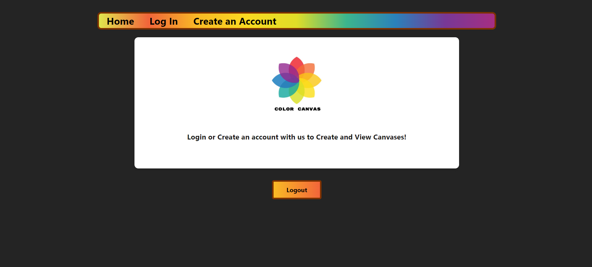
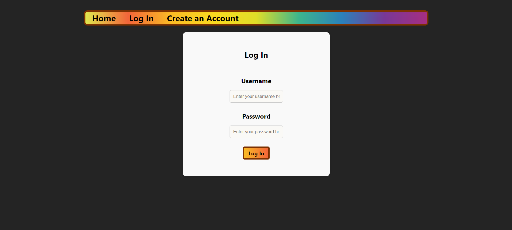
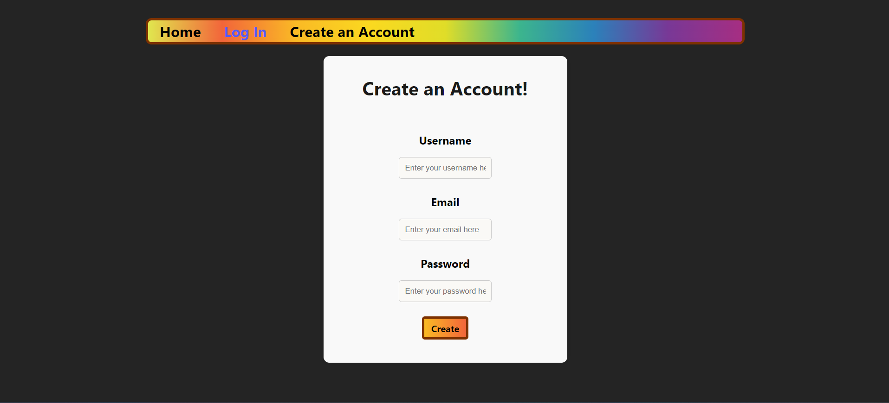
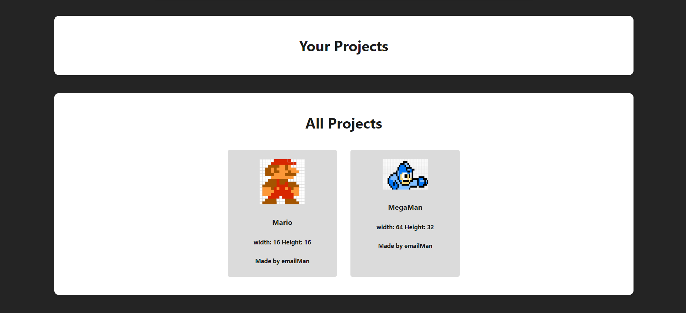
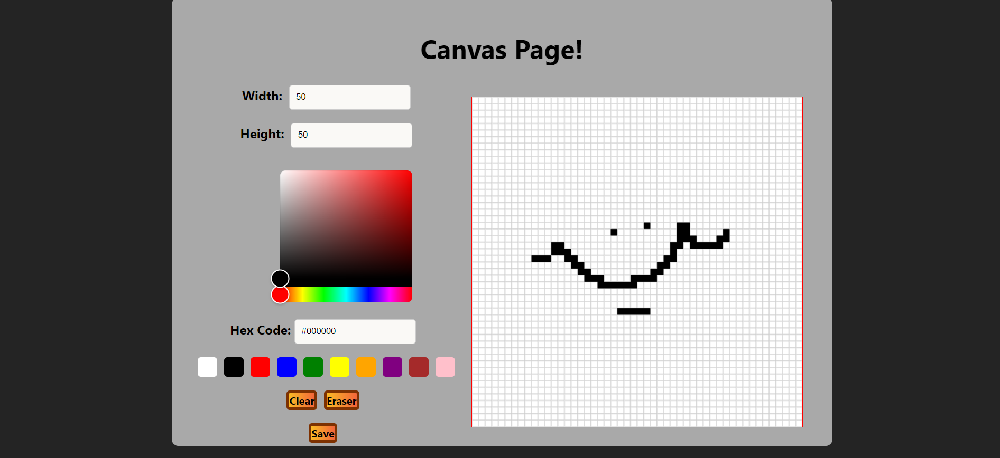
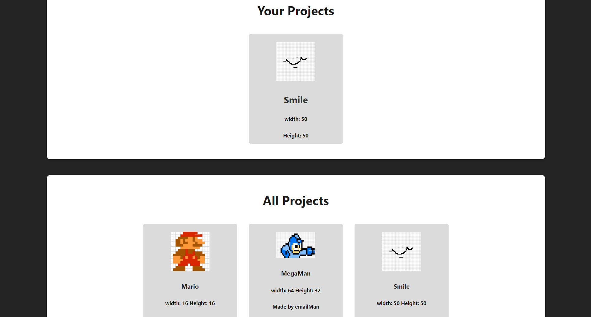

# Color Canvas (Project 02)

## Introduction


[](https://opensource.org/licenses/MIT)
[](https://github.com/ellerbrock/typescript-badges/)

Our website is a creation tool and creating sharing platform that lets users create and share images on our website. It was made to inspire creativity in users.

To visit our site online you can click this <a href=https://color-canvas.onrender.com>link</a> to go to our deployed site!

## Table of Contents

- [Required-Technologies](#required-technologies)
- [Installation](#installation)
- [Usage](#usage)
- [Code Snippet](#code-snippet)
- [Screenshots](#screenshots)
- [Features](#features)
- [Future-Features](#future-features)
- [License](#license)
- [Technologies](#technologies-used)
- [Credits](#credits)
- [Contact Me](#contact-me)

## Required Technologies

This project requires node.js and its included node package manager.\
You can go to <a href="https://nodejs.org/en/download/package-manager">this</a> website to download node.js and npm. Just follow node's included download instructions!

Postgres SQL is also required to run the project and interface with the database. You can download Postgres with <a href="https://www.postgresql.org/download/">this</a> link. Follow the Postgres guide to install correctly.

## Installation

Once the files are downloaded onto your machine open the project folder and run the terminal in the root directory.
To install the necessary dependencies run the "npm i" command and the "npm run install" command to install all dependancies.

Navigate the terminal to the server/db and then using postgres run "psql -U {Postgres Username}". Once Postgres has been started run "\i schema.sql;" to start the database. You can then do \q to exit the postgres terminal.

Then navigate to the root of the server directory and click on the ".env.EXAMPLE" file. This will be used to interface with your installed instance of Postgres. There are fields for the Postgres username, and your Postgres password (the same username and password you used before to sign into the terminal). There is also a field for a "JWT_SECRET_KEY". This is optional but you can input a key to be used when encrypting a token to further secure your token. Once all fields have been filled out rename the file to just ".env".

(optional) Once installed, run "npm run seed" to seed the database

Now everything is installed correctly! Run "npm run start:dev" to start the website! The local host link will be provided in the console upon startup.

(See the package.json file for a list of commands for when running the website)

## Usage

Once the start command has been run and the site is up and running you will be greeted by our home page. The home page wont display any content till you have signed in or created an account on our site. Using the nav bar located at the top of the screen you can navigate to our sign in or create and account page.

Assuming that you have not created an account you can navigate to our create an account page. Once clicked on you will be greeted by our create a user page. There are fields for a username, email, and password. All fields must be filled out. In addition, the email must be a correct email, it must have a @ and a site it refers to (example: example@example.net). The inputted email and username must also be ones that already do not exist in the database. Untill these conditions are met the site will not let you create an account. Once youve inputted your information you can hit the submit button to create an account.

Once a valid account has been you will be redirected to our home page. If you ran the "npm run seed" command before starting the site you will see various images. There are sections on the home page for User made projects and all created projects. There is also now link to the canvas page located on the nav bar. Images will be displayed in the user made projects and the all created projects. Each card has an image, a username, width, and height sections.

To create a project navigate to the canvas page by clicking the canvas link on the nav bar. You will be greeted by a page containing a canvas, width and height input boxes, a color selector, a hex code input box, a color buttons, an eraser, a clear button, and an save button. They all essentially do what the name suggests. Inputting values into the width and height boxes will change the canvas width and height respectively. We have a color selector thanks to <a href=https://www.npmjs.com/package/react-colorful>React Colorful</a>, a color picker api. You can drag the cursor on the box to select a color. The bottom bar lets you select a wide range of colors and the top box lets you pick a shade of that color. The hex code box will change depending on the color selected, you may also choose specific colors by inputting a hex code into that box.

Once your done messing with the width, height, and colors you can now click on the canvas to draw a pixel with the selected color. You can also click and drag on the canvas to draw a continous trail. If you want to erase a drawn pixel you can click on the eraser button and then click on the pixel you wish to remove. You can also click and drag with the eraser as well. if you wish to start fresh the clear button will erase everything put onto the canvas. Once your done drawing a canvas you can click the save button to start the upload process. You will first be prompted with an input box asking for the title of your project. If no name is inputted your project will just have a title of 'title'. Then you will be prompted with a box asking if you want to save the canvas you created onto your computer. Clicking yes will save a png file of your canvas with the title of the given title of your project. You will then be redirected to the home page.

Back on the home page your project will now be displayed on the user projects and the all projects tab. If you wish to sign out you can scroll to the bottom of the page and hit the log out button to be logged out of the website.

## Code Snippet

This code is used to upload the canvas to the database. Once the save button is clicked on the process is started. We first grab the username from the jwt token, which is stored in local storage once a user has signed in. We use this username to then retrieve the user id data by making a fetch request to the server. We then convert the canvas to a base64 string for storing in the database. We prompt the user for a title and structure the image Object with all of the provided information. Next we ask the user if they wish to save their canvas to their computer.

When users select yes to downloading an image of their canvas we first create an anchor element. We assign that anchor element an href of the image data. We give its download a title of the given image title plus the png tag. We then use .click() to force a click of this anchor element which saves the image to the users computer.

After everything we then send the image Object off to the createImage function, which sends a put request to the database. We then send the user back to the homepage using the window.location.assign method.

```
const uploadCanvas = async () => {
        console.log('Uploading...')

        try {
            //grab the users data by username
            const usernameData = Auth.getProfile()
            const idData =  await retrieveUser(usernameData.username)

            const canvas = canvasRef.current;
            if(!canvas) return;

            //convert image to a base64 String
            const dataUrl = canvas?.toDataURL('image/png');

            const imageName = window.prompt('What do you wanna name your Project?') || 'title'
            //structure the image object
            const imageObj: any = {
                title: imageName,
                width: dimensionData.width,
                height: dimensionData.height,
                imageData: dataUrl,
                userId: idData.id,
            }

            //ask user if they wish to save the image to their computer
            const saveImage = window.confirm('Would you Like to save the image?')
            if (saveImage) {
                const link = document.createElement('a');
                link.href = dataUrl;
                link.download = imageName + '.png';
                link.click();
            }

            const result = await createImage(imageObj);
            console.log('Image Uploaded successfully: ', result);
            window.location.assign('/')

        } catch (err: any) {
            console.error('Error Uploading image Data:', err)
        }
    }
```

## Screenshots



This is the home page.



This is the login page.



This is the Create an account page.



Once you have signed in or created an account projects will now display on the page!



This is the canvas page. You create and upload images here!



Now that an image has been saved it is now displayed on the home page.

## Features

Features include:
-Sign in with username and password
-Create accounts with username, email, and password
-View created projects
-Create projects with options to change color and canvas size

## Future Features

Features that may be implemented in the future include:

-Bug fixes
-User Experience updates
-Delete projects
-filter projects
-Display projects not all at once

## License

Licensed under the MIT license.

## Technologies Used

<ul>
<li>Node.js (for installing packages as well as building and running code).</li>
<li>Vite (for running a local server, and development).</li>
<li>
<li>Visual Studio Code (for writing code).</li>
<li>Stack Overflow (for debugging and help writting the canvas)
<li>Mozila Web Docs and W3 Schools (for getting help with TypeScript).</li>
</ul>

## Credits

<ul>
<li>Mekenna Baker</li>
<li>Pedro Chipanna</li>
<li>Joshua Pruitt</li>
<li>Coding bootcamp staff (for their help with Coding)</li>
<ul>

## Contact Me

<table>
    <tr>
        <th>Name</th>
        <th>Email</th>
        <th>GitHub Link</th>
        <th>LinkedIn Link</th>
    </tr>
    <tr>
        <td>Mekenna Baker</td>
        <td></td>
        <td><a href=https://github.com/Mekenna-Baker>GitHub</a></td>
        <td><a href=https://www.linkedin.com/in/mekenna--baker/>LinkedIn</a></td>
    </tr>
    <tr>
        <td>Pedro Chippana</td>
        <td></td>
        <td><a href=https://github.com/PeruvPowWow>GitHub</a></td>
        <td></td>
    </tr>
    <tr>
        <td>Joshua Pruitt</td>
        <td>joshuapruitt6484@gmail.com</td>
        <td><a href=https://github.com/JoshuaPruitt>GitHub</a></td>
        <td><a href=https://www.linkedin.com/in/joshua-pruitt-1a494a311>LinkedIn</a></td>
    </tr>
</table>
